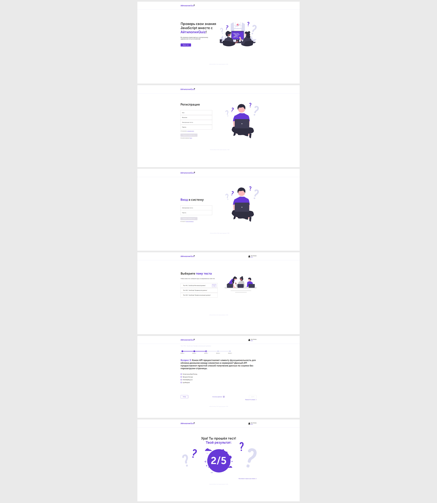

# Веб-приложение quiz-викторина (TypeScript)

Самостоятельно выполненный проект в рамках обучения на курсе "Профессия Frontend-Разработчик" в онлайн-школе "Айтилогия".

## Внешний вид

## Выполненные задачи:
- Реализация frontend-части SPA в соответствии с техническим заданием и макетов;
- Практика использования TypeScript для реализации SPA (использование компонентов, сервисов, роутинг, запросы, шаблоны);
- Практика применения ООП-подхода для создания SPA;
- Практика использования Webpack для сборки проекта, копирования нужных файлов;
- Практика использования Postman для работы с запросами на backend.

## Возможности:
* Регистрация, авторизация пользователя;
* Выбор теста для прохождения;
* Возможность выбрать ответ либо пропустить вопрос;
* После прохождения теста пользователь узнает свой результа;

## Используемые технологии:
* HTML
* CSS
* TypeScript
* WebPack
* JWT-Авторизация
* Используется заранее подготовленный backend на node.js